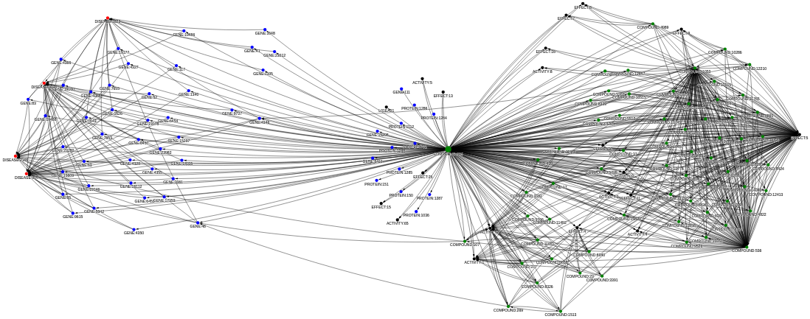

kgw
###

Welcome! This is the documentation for
:doc:`kgw <rst/package_references>`,
an open-source Python 3 package for downloading, converting and
analyzing knowledge graphs.

.. figure:: images/workflow.png
   :scale: 90 %
   :align: center
   :alt: Workflows enabled by kgw

   Visual overview of ETL workflows supported by this package.

What is this project about?
===========================

The name "kgw" is an acronym for "knowledge graph workflows".
This phrase consists of two components with following meaning:

1. A
   `knowledge graph <https://en.wikipedia.org/wiki/Knowledge_graph>`__,
   in the following abbreviated as KG, is information organized in a graph data model.
2. A
   `workflow <https://en.wikipedia.org/wiki/Workflow>`__
   is an organized and repeatable pattern of activity.

In essence, this project allows to define and run reproducible workflows
that retrieve particular knowledge graphs from the web, convert them into
chosen target formats, and analyze their contents.

Which goals are pursued by this project?
========================================

There are three central motivations that drive this project:

1. Ease access to high-quality knowledge graphs that are generated
   by academic projects but shared in various formats on different
   data repositories in a non-standardized way.
2. Provide comparable insights into the contents of these knowledge
   graphs, such as their schemata and statistical properties.
3. Support the ongoing development of a novel AI/ML framework named
   `OpenCog Hyperon <https://hyperon.opencog.org>`__,
   in particular with respect to scalable representation and querying
   of knowledge in it.

These objectives are pursued by following means:

1. The package allows to easily define and run
   `ETL <https://en.wikipedia.org/wiki/Extract,_transform,_load>`__
   workflows:

   - **Extract** a KG from a data repository.

     A user defines a KG, the desired version of it, and a local working
     directory. The package downloads all relevant files from the
     data repository of the project into a uniquely named subdirectory.

   - **Transform** the KG to a unified intermediate format.

     Different projects use different ways to represent their KGs.
     To unify them into a single intermediate representation,
     the model of a
     `property graph <https://en.wikipedia.org/wiki/Property_graph>`__
     was chosen and encoded in form of a file-based
     `SQLite database <https://www.sqlite.org>`__.
     This allows to capture almost any knowledge graph encountered
     in practice without any loss or modification of information.

   - **Load** the KG into various target formats.

     A user defines into which target formats a KG shall be converted.
     Currently supported are
     `CSV <https://en.wikipedia.org/wiki/Comma-separated_values>`__,
     `JSONL <https://jsonlines.org>`__,
     `SQL <https://docs.fileformat.com/database/sql>`__,
     `GraphML <https://en.wikipedia.org/wiki/GraphML>`__
     and several
     `MeTTa <https://metta-lang.dev>`__
     representations.
     All target formats are derived from a single source format,
     which is the SQLite file that uses the same relational database schema
     for every KG. This implies that exactly one conversion method has to
     be implemented per target format. It is therefore easy to add
     additional methods and formats with minimal programming and testing
     effort.

2. The package supports some ways to **analyze** the content
   of the knowledge graphs:

  - Calculate summary statistics.

    A JSON file captures quantitative aspects such as node, edge and type counts.
    This enables comparsions between reported numbers in the project publications
    and actual element counts in the raw data, but also comparisons between KGs
    to see differences in coverage and scale.

  - Detect and visualize the
    `schema <https://memgraph.com/docs/fundamentals/graph-modeling#designing-a-graph-database-schema>`__
    of a KG.

    A standalone HTML file contains an interactive graph visualization of all
    node types in the KG as well as the edge types that connect them. Hovering over
    nodes and edges provides additional information such as the number of instances
    of a particular node or edge type. This is also indicated visually by different
    node and edge sizes, providing a graphical overview of what kinds of nodes are
    edges are making up the majority of information stored in a KG.
    `Examples of such schemata <https://github.com/robert-haas/awesome-biomedical-knowledge-graphs>`__
    can be found in the last section of a repository about biomedical knowledge graphs,
    which served as preparation for this package.

3. The package allows to bring a diversity of knowledge graphs to the
   `OpenCog Hyperon <https://hyperon.opencog.org>`__
   framework:

   Knowledge graphs of different shapes and sizes, built on various ontologies,
   and coming with all kinds of properties, are flexibly ported to
   OpenCog Hyperon's language
   `MeTTa <https://metta-lang.dev>`__.
   Conceptually, knowledge graphs can be represented in a large number of ways in MeTTa,
   with no clearly preferable approach yet, hence the package supports multiple MeTTa
   representations and it is easily extendable to support further ones. This shall
   enable experimentation on how to represent and query KGs efficiently at scale,
   which can also be used for performance benchmarking of different MeTTa interpreters
   that are under active construction at the time of creating this package and
   writing its documentation.

Why is it relevant?
===================

Since there are no widely accepted standards for how
to encode knowledge graphs, academic projects provide
their results in various formats and share them via
different data repositories on the web. This situation
makes it hard for an interested audience to use and
compare them. It can be largely resolved, however, by providing
automatic download methods, a definition and implementation
of a unified KG representation, and a set of conversion methods
into widely-used target formats. The hope is to thereby reduce
some barriers of science, and perhaps catalyze analyses and
experiments that otherwise would not take place. A simple example
is the interactive exploration of the neighborhood of a node of
interest, such as a certain disease and all the genes and drugs it
is connected with.

   Direct neighborhood of a selected node within a large biomedical knowledge graph.

How can you get started?
========================

If you want to use this package, the following steps should
help you to get results in a short time:

1. The :doc:`Installation Guide <rst/installation>`
   describes how you can install the package and its
   optional dependencies.

2. The :doc:`Examples <rst/examples>`
   provide a minimal quickstart guide that can be
   run immediately after the installation to see whether
   it worked, and a more detailed guide that provides
   a thorough introduction into most features.

3. The :doc:`API Documentation <autoapi/index>`
   contains a comprehensive description of all user-facing
   functionality available in this package, so you can see the full
   range of available options.

Where can everything be found?
==============================

The :doc:`Package References <rst/package_references>`
page contains a collection of links to all parts of this project,
including the source code, distributed code and documentation.

Who is involved in this project?
================================

- The design, implementation and documentation of this package was
  done by
  `Robert Haas <https://github.com/robert-haas>`_.

- Preliminary work was published in the repository
  `awesome-biomedical-knowledge-graphs <https://github.com/robert-haas/awesome-biomedical-knowledge-graphs>`__.
  It contains notebooks with exploratory data analysis of the KG projects
  that culimanted in the code of this package. Beyond that, it also
  provides a broad literature survey and a curated selection of BMKGs,
  which gives a more comprehensive account of available KGs in the field
  of biomedicine and can serve as basis to incorporate further projects
  into this package.

- Financial support to realize this project was granted by the
  `Deep Funding <https://deepfunding.ai>`__
  initiative of
  `SingularityNET <https://singularitynet.io>`__
  for a proposal titled
  `Bringing Network Pharmacology to OpenCog Hyperon
  <https://deepfunding.ai/proposal/bringing-network-pharmacology-to-opencog-hyperon>`__.
  Due to the interest in and focus on pharmacological use cases, such as drug
  repurposing or side-effect prediction, the currently covered KGs all contain
  node types that represent drugs, their targets and affected diseases, although
  to quite different extent and levels of differentiation. This provides
  a close look into how different academic groups approach the modeling challenges
  and how these choices affect the complexity of querying relevant information
  and deriving new insights. A hope for this work is that its insights are
  informative for new projects that model biomedical data in their own ways to
  power specific use cases. One such project with close relations to
  SingularityNET is
  `Rejuve <https://www.rejuve.bio>`__,
  which continuously integrates up-to-date biological data from various sources
  into their own BMKG for applications in longevitiy research.

Table of contents
=================

.. toctree::
   :maxdepth: 1

   rst/package_references
   rst/installation
   rst/examples